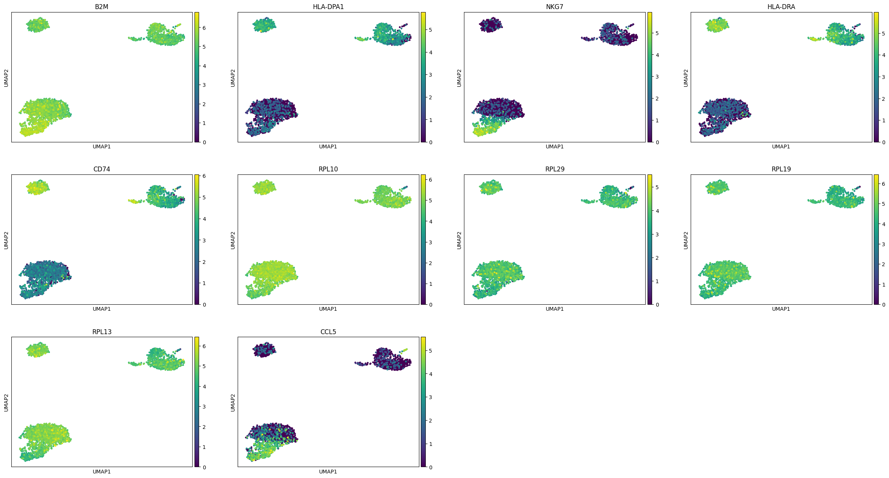

# 03_PBMC_TCell_Classifier
Applying Machine Learning (Random Forest) for cell type classification and feature importance analysis based on single-cell RNA-seq data.

## 🤖 Project 03：單細胞數據機器學習分類器

### 🎯 專案目標 (Project Goal)
利用 Day 2 清洗後的單細胞基因表現數據，訓練一個高度準確的 Random Forest 分類器，以區分 **T 細胞 (T-cell)** 與 **非 T 細胞 (Non-T-cell)**，並透過特徵重要性分析來解釋生物學機制。

### 🛠️ 核心技術棧 (Core Technologies)
* **Scikit-learn (sklearn):** 機器學習模型訓練 (Random Forest)、數據切分、交叉驗證。
* **GridSearchCV:** 系統化超參數搜尋，確保模型性能最優化和穩健性。
* **Feature Importance:** 模型可解釋性分析。

---

### 📈 階段一：數據準備與基礎模型 (Day 3)

1.  **數據準備：** 使用 Day 2 儲存的 2638 個細胞和 1826 個高變異基因。
2.  **標籤創建：** 根據 Leiden 分群結果，創建 `T-cell` (1) 和 `Non-T-cell` (0) 二元標籤。
3.  **模型結果 (未優化)：**
    * 測試集整體準確度：`0.8574`
    * T 細胞召回率 (Recall)：`0.97` (成功找出絕大多數 T 細胞)

### 🚀 階段二：模型優化與特徵選擇 (Day 4)

#### 1. 超參數搜尋 (Hyperparameter Tuning)

使用 5 折交叉驗證 (5-fold CV) 進行網格搜尋，找到最佳模型參數：

-   **最佳超參數組合：** `{'max_depth': None, 'min_samples_split': 5, 'n_estimators': 200}`
-   **最佳交叉驗證準確度：** `0.8602`

#### 2. 優化後性能報告

| 類別 | 精確率 (Precision) | 召回率 (Recall) | F1-score |
| :--- | :--- | :--- | :--- |
| **Non-T-cell (0)** | **0.92** | 0.70 | 0.79 |
| **T-cell (1)** | 0.82 | **0.96** | 0.88 |
| **整體準確度 (Accuracy):** | `0.8481` | | |
**結論：** 優化後模型具備良好的泛化能力，並維持了對 T 細胞類別的極高召回率。

#### 3. 特徵重要性分析 (Feature Importance)

模型依據重要性排名的 Top 10 基因，證明了分類器的決策具有**生物學可解釋性**：

| 排名 | 基因 (Gene) | 關鍵生物學功能 |
| :--- | :--- | :--- |
| 1 | B2M | MHC Class I 相關，廣泛參與免疫反應。 |
| 2 | HLA-DPA1 | 關鍵 MHC Class II 基因，與抗原呈遞細胞 (APCs) 相關。 |
| 3 | NKG7 | T 細胞/NK 細胞功能標誌物。 |
| 4 | HLA-DRA | 關鍵 MHC Class II 基因。 |
| 5 | CD74 | MHC Class II 相關蛋白。 |
| 6-10 | RPLs/CCL5 | 核糖體蛋白與趨化因子，反映細胞代謝活性與遷移能力。 |

### 🖼️ 最終視覺化成果 (Day 5 待完成)

上圖展示了 Top 10 關鍵基因在 UMAP 空間中的表現強度。可以清楚看到，這些高重要性基因的表現強度熱區，與 Day 2 專案中識別出的**不同細胞群集**高度吻合，從而佐證了機器學習模型的分類依據。
